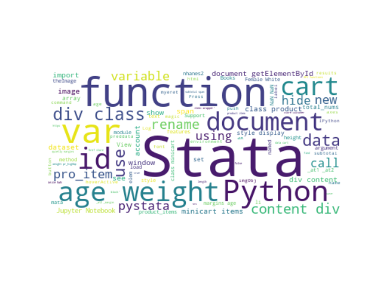

# Stata Python integration

##  [Hua Peng@StataCorp][hpeng]
### 2021 JSM 
### [https://huapeng01016.github.io/2021-jsm/](https://huapeng01016.github.io/2021-jsm/)

# Stata 16 introduces tight integration with Python

- Use Python interactively
- Define and use Python routines in do and ado files
- Interact with Stata through [Stata Function Interface (sfi)](https://www.stata.com/python/api17/) 

# Stata 17 introduces calling Stata from Python

- Use Stata from Jupyter Notebook with magic commands
- Use Stata from Python scripts with pystata API   
- More information at [https://www.stata.com/python/pystata/](https://www.stata.com/python/pystata/)

# Call Stata from Jupyter Notebook

- [An example](./jupyter_stata.html) of calling Stata from Jupyter Notebook.
- The source [notebook jupyter_stata.ipynb](./jupyter_stata.ipynb)

# Call Stata from Python Scripts 

- Call Stata using pystata API
- An example [did.py](./src/did.py)
- More information at [https://www.stata.com/python/pystata/api.html](https://www.stata.com/python/pystata/api.html)

# Call Python from Stata

## Interactively

~~~~
<<dd_do>>
python:
print('Hello World!')
end
<</dd_do>>
~~~~

## Import Python packages 

~~~~
<<dd_do>>
python:
import numpy as np
from sfi import Platform

import matplotlib
if Platform.isWindows():
	matplotlib.use('TkAgg')

import matplotlib.pyplot as plt
from mpl_toolkits import mplot3d
from sfi import Data
end
<</dd_do>>
~~~~

## Use **sfi** to move between Stata and Python

We use the Stata **sandstone** example dataset.

~~~~
<<dd_do>>
use https://www.stata-press.com/data/r17/sandstone, clear
* Use sfi to get data from Stata
python:
D = np.array(Data.get("northing easting depth"))
end
<</dd_do>>
~~~~

## Draw surface plot

We use a triangular mesh to produce the graph.   

~~~~
python:
ax = plt.axes(projection='3d')
plt.xticks(np.arange(60000, 90001, step=10000))
plt.yticks(np.arange(30000, 50001, step=5000))
ax.plot_trisurf(D[:,0], D[:,1], D[:,2], cmap='viridis', edgecolor='none')
plt.savefig("sandstone.png")
end
~~~~

<<dd_do:quietly>>
python:
ax = plt.axes(projection='3d')
plt.xticks(np.arange(60000, 90001, step=10000))
plt.yticks(np.arange(30000, 50001, step=5000))
ax.plot_trisurf(D[:,0], D[:,1], D[:,2], 
	cmap='viridis', edgecolor='none')
plt.savefig("sandstone.png")
end
<</dd_do>>

## Output

## Change color map and view angle

~~~~
python:
ax.plot_trisurf(D[:,0], D[:,1], D[:,2], 
	cmap=plt.cm.Spectral, edgecolor='none')
ax.view_init(30, 60)
plt.savefig("sandstone1.png")
end
~~~~

<<dd_do:quietly>>
python:
ax.plot_trisurf(D[:,0], D[:,1], D[:,2], cmap=plt.cm.Spectral, edgecolor='none')
ax.view_init(30, 60)
plt.savefig("sandstone1.png")
end
<</dd_do>>

## Output

## Animation ([do-file](./stata/gif3d.do))

# Support Vector Machine (SVM)

## Train program ([pysvm2.ado](./stata/pysvm2.ado))

~~~~
program pysvm2
	version 16
	syntax varlist(min=3) [if] [in] 
	gettoken label features : varlist
	marksample touse
	qui count if `touse'
	if r(N) == 0 {
		di as error "no observations"
		exit 2000
	}
	
	qui summarize `label' if `touse' 
	if r(min) >= r(max) {
		di as error "outcome does not vary"
		exit 2000
	}
	
	quietly python: dosvm2("`label'", "`features'", "`touse'")	
	di as text "note: training finished successfully"
end
~~~~

## Python routine in [pysvm2.ado](./stata/pysvm2.ado)

~~~~
python:
import sys
from sfi import Data, Macro
import numpy as np
from sklearn.svm import SVC
import __main__

def dosvm2(label, features, select):
	X = np.array(Data.get(features, selectvar=select))
	y = np.array(Data.get(label, selectvar=select))

	svc_clf = SVC(gamma='auto')
	svc_clf.fit(X, y)
	
	__main__.svc_clf = svc_clf 
	Macro.setGlobal('e(svm_features)', features)
	return svc_clf
end
~~~~

## Predict program ([pysvm2predict.ado](./stata/pysvm2predict.ado))

~~~~
program pysvm2predict
	version 16
	syntax anything [if] [in]

	gettoken newvar rest : anything
	if "`rest'" != "" {
		exit 198
	}
	confirm new variable `newvar'	
	marksample touse
	qui count if `touse'
	if r(N) == 0 {
		di as text "zero observations"
		exit 2000
	}

	qui replace `touse' = _n if `touse' != 0 	
	python: dosvmpredict2("`newvar'", "`touse'")
end
~~~~

## Python routine in [pysvm2predict.ado](./stata/pysvm2predict.ado)

~~~~
python:
import sys
from sfi import Data, Macro
import numpy as np
from sklearn.svm import SVC
from __main__ import svc_clf

def dosvmpredict2(predict, select):
	features = select + " "+ Macro.getGlobal('e(svm_features)')
	X = np.array(Data.get(features, selectvar=select))

	y_pred = svc_clf.predict(X[:,1:])
	y1 = np.reshape(y_pred, (-1,1))

	y = np.concatenate((X, y1), axis=1)
	Data.addVarDouble(predict)
	dim = y.shape[0]
	j = y.shape[1]-1
	for i in range(dim):
		Data.storeAt(predict, y[i,0]-1, y[i,j])
	
end
~~~~

## Pass Python object between ado files

In [pysvm2.ado](./stata/pysvm2.ado) ado code:

~~~~
...
import __main__ 
...
__main__.svc_clf = svc_clf
...
~~~~

## 
To access **svc_clf** in Python routines in ado files: 

~~~~
...
from __main__ import svc_clf
...
~~~~

## Test on **auto** dataset

<<dd_do: quietly>>
adopath + ./stata
sysuse auto, clear
set seed 12345
<</dd_do>>

~~~~
<<dd_do>>
pysvm2 foreign mpg price if runiform() <= 0.2
pysvm2predict for2
<</dd_do>>
~~~~

## Output

~~~~
<<dd_do>>
label values for2 origin
tabulate foreign for2, nokey
<</dd_do>>
~~~~

# References

- [Stata Python](https://www.stata.com/python/)
- [pystata](https://www.stata.com/python/pystata/)
- [sfi](https://www.stata.com/python/api17/)

# Thanks!

[hpeng]: hpeng@stata.com
